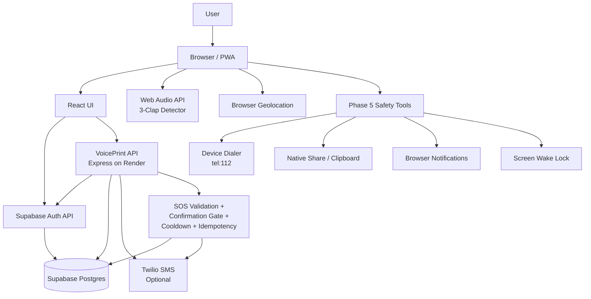
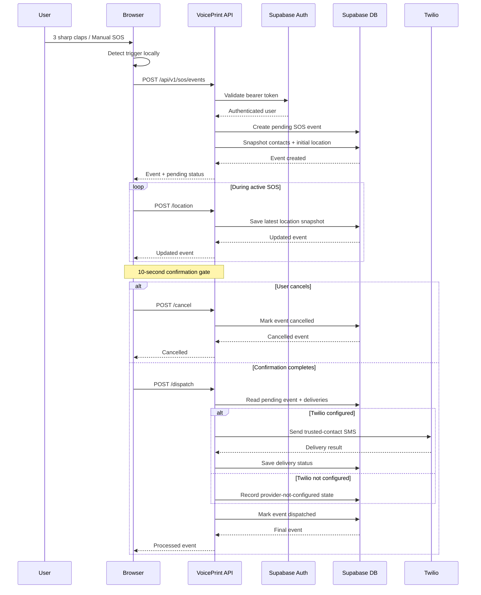
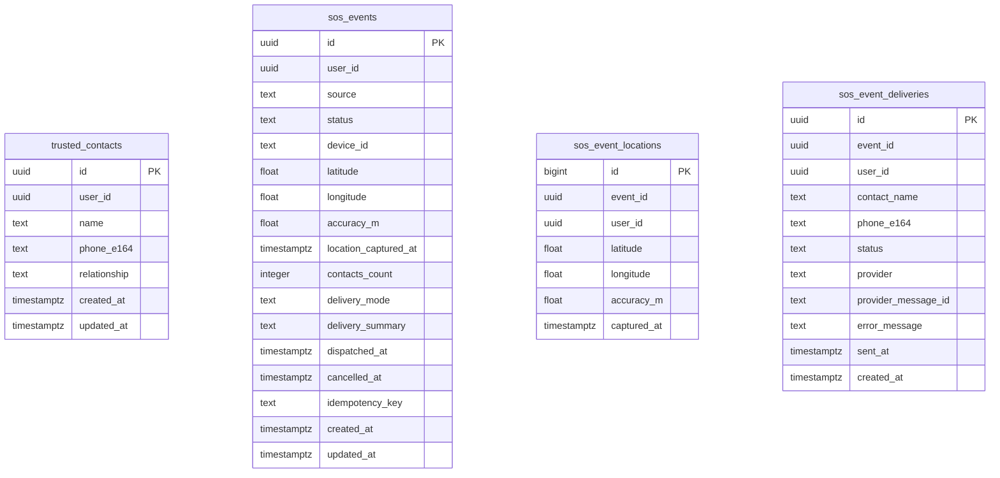

# VoicePrint

> **Hands-free emergency safety system** built around local trigger detection, live location, authenticated cloud storage, trusted contacts, and a controlled SOS workflow.

VoicePrint is designed for situations where a person may not be able to comfortably reach, unlock, type on, or speak into a phone. The current web application can monitor a local three-clap pattern, obtain device location, create an authenticated SOS event, keep a short confirmation window, persist the event, and optionally deliver SMS alerts to trusted contacts when a server-side Twilio configuration is present.

> **Important:** VoicePrint is a safety-assistance prototype, not a guaranteed emergency-response system. Browser microphone monitoring is not guaranteed while a browser/app is suspended or completely closed. The current project does **not** directly dispatch police, ambulance, or other public emergency responders.

---

## What VoicePrint Does

### Hands-free trigger
- Detects **three distinct sharp claps** within a short time window.
- Audio analysis happens locally in the browser.
- A manual SOS test is also available.

### Location
- Uses browser geolocation with high-accuracy settings.
- Keeps the latest coordinates available during an active SOS flow.
- Stores location snapshots for authenticated SOS events.

### Cloud safety
- Supabase Auth handles accounts and sessions.
- Trusted contacts are stored per authenticated user.
- SOS history persists across sessions.
- API requests use the authenticated user's access token.

### SOS workflow
1. Trigger is detected.
2. A cloud SOS event is created.
3. A **10-second confirmation window** starts.
4. Location can be updated while the flow is active.
5. The user can cancel during the confirmation window.
6. After the confirmation gate, the backend can process delivery.
7. If Twilio is configured, SMS messages are sent to stored trusted contacts.
8. The final event appears in SOS history.

### Phase 5 safety tools
- Online/offline state indicator.
- Browser notification permission flow.
- Screen Wake Lock when supported.
- Share current location.
- `tel:112` quick-call action.
- PWA manifest and install support where the browser allows it.
- Service worker shell caching without caching private API responses.

---

# Architecture



## SOS Event Flow



---

# Tech Stack

| Layer | Technology |
|---|---|
| Frontend | React 19 + Vite |
| Styling | Custom CSS |
| Browser audio | Web Audio API |
| Location | Browser Geolocation API |
| Authentication | Supabase Auth |
| Database | Supabase PostgreSQL |
| Backend | Node.js + Express |
| Security middleware | Helmet + CORS + express-rate-limit |
| SMS | Twilio *(optional)* |
| Hosting | Vercel + Render |
| PWA | Web App Manifest + Service Worker |
| Source control | GitHub |

---

# Project Structure

```text
VoicePrint/
├── public/
│   ├── manifest.webmanifest
│   ├── sw.js
│   └── voiceprint-icon.svg
│
├── server/
│   ├── index.js
│   ├── package.json
│   ├── .env.example
│   ├── validation.js
│   ├── test/
│   │   └── validation.test.js
│   └── README.md
│
├── src/
│   ├── components/
│   │   ├── Phase4Account.jsx
│   │   ├── Phase4Contacts.jsx
│   │   ├── Phase4Control.jsx
│   │   ├── Phase4History.jsx
│   │   ├── Phase4Home.jsx
│   │   ├── Phase4Modal.jsx
│   │   ├── Phase5SafetyActions.jsx
│   │   ├── Phase6ReliabilityPanel.jsx
│   │   ├── Phase7ErrorBoundary.jsx
│   │   ├── Phase7PrivacyPanel.jsx
│   │   ├── Phase8OperationsPanel.jsx
│   │   ├── Phase9IncidentPanel.jsx
│   │   └── Phase10ReadinessPanel.jsx
│   │
│   ├── hooks/
│   │   ├── useSafetySensors.js
│   │   ├── usePhase4Core.js
│   │   ├── usePhase5Enhancements.js
│   │   ├── usePhase6Status.js
│   │   ├── usePhase8DeploymentStatus.js
│   │   ├── usePhase9Incident.js
│   │   └── usePhase10Readiness.js
│   │
│   ├── lib/
│   │   ├── apiAuth.js
│   │   ├── auth.js
│   │   ├── sosApi.js
│   │   └── supabase.js
│   │
│   ├── Phase4App.jsx
│   ├── Phase5App.jsx
│   ├── Phase6App.jsx
│   ├── Phase8App.jsx
│   ├── phase4-entry.jsx
│   ├── phase5-entry.jsx
│   ├── phase6-entry.jsx
│   ├── phase7-entry.jsx
│   ├── phase8-entry.jsx
│   └── index.css
│
├── supabase/
│   └── migrations/
│       ├── phase_4_rls.sql
│       ├── phase_5_hardening.sql
│       ├── phase_6_reliability_hardening.sql
│       └── phase_8_rls_activation.sql
│
├── index.html
├── vercel.json
├── scripts/
│   ├── verify-phase9.mjs
│   └── verify-phase10.mjs
├── package.json
└── README.md
```

---

# Local Development

## 1. Clone the repository

```bash
git clone https://github.com/ayushydv1805/VoicePrint.git
cd VoicePrint
```

## 2. Install frontend dependencies

```bash
npm install
```

## 3. Start the frontend

```bash
npm run dev
```

Vite will print the local development URL in the terminal.

## 4. Start the backend

Open another terminal:

```bash
cd server
npm install
npm run dev
```

The API defaults to:

```text
http://localhost:5000
```

For a production-style start:

```bash
npm start
```

---

# Environment Variables

## Frontend

The frontend supports:

```env
VITE_API_URL=https://your-render-api.example.com
VITE_SUPABASE_URL=https://your-project.supabase.co
VITE_SUPABASE_PUBLISHABLE_KEY=your-supabase-publishable-key
```

The current code also contains safe development defaults for the configured VoicePrint Supabase project and Render API.

**Never place Twilio secrets in frontend environment variables.**

## Backend

Create `server/.env` from `server/.env.example`.

```env
PORT=5000
CORS_ORIGINS=https://your-vercel-domain.example

ALERT_COOLDOWN_SECONDS=30
LOCATION_UPDATE_MIN_SECONDS=5
CONFIRMATION_WINDOW_SECONDS=10
VOICEPRINT_RELEASE=phase-10

# Optional SMS delivery. Keep these server-side secrets private.
TWILIO_ACCOUNT_SID=
TWILIO_AUTH_TOKEN=
TWILIO_FROM_NUMBER=
```

Twilio credentials must remain **server-side only**.

---

# Database

The current project uses four public tables:

```text
trusted_contacts
sos_events
sos_event_locations
sos_event_deliveries
```

Conceptually:



Phase 5 database hardening also adds:
- indexes for user/event lookups,
- E.164 phone validation,
- allowed SOS source/status constraints,
- latitude/longitude range checks,
- delivery-status constraints,
- automatic `updated_at` triggers.

---

# Security Model

The API requires an authenticated Supabase bearer token for cloud features.

Every protected query is scoped to the authenticated user's ID:

```text
Authenticated User
        │
        ▼
Supabase Access Token
        │
        ▼
VoicePrint API
        │
        ├── contacts WHERE user_id = current_user
        ├── events   WHERE user_id = current_user
        ├── location WHERE user_id = current_user
        └── delivery WHERE user_id = current_user
```

The server also implements:
- Helmet security headers.
- CORS restrictions.
- General API rate limiting.
- SOS-specific rate limiting.
- SOS cooldown.
- Server-side confirmation gate.
- Idempotency-key replay protection.
- Input validation for phone numbers and coordinates.
- Device identifier persistence.
- No API/auth response caching in the service worker.

---

# API Endpoints

## Health

```http
GET /api/health
```

Returns service health and high-level configuration state.

## Status

```http
GET /api/v1/status
```

Returns enabled VoicePrint capabilities.

## Trusted Contacts

```http
GET    /api/v1/contacts
POST   /api/v1/contacts
DELETE /api/v1/contacts/:id
```

## SOS History

```http
GET /api/v1/history
```

## SOS Events

```http
POST /api/v1/sos/events
POST /api/v1/sos/events/:id/location
POST /api/v1/sos/events/:id/dispatch
POST /api/v1/sos/events/:id/cancel
```

---

# SOS Protection Logic

VoicePrint intentionally separates **trigger detection** from **final dispatch**.

### Client-side trigger

```text
3-clap pattern
      │
      ▼
Local audio detection
      │
      ▼
Emergency flow UI
      │
      ▼
Create pending cloud event
```

### Server-side confirmation

```text
Pending event
      │
      ├── Cancelled before gate ──> cancelled
      │
      └── Confirmation window ends
                │
                ▼
             Dispatch
                │
        ┌───────┴────────┐
        ▼                ▼
   Twilio ready      Twilio absent
        │                │
        ▼                ▼
   Send SMS         Record provider
        │              not configured
        └────────┬───────┘
                 ▼
             dispatched
```

This server-side gate prevents a client-only countdown from being the only protection around alert delivery.

## Phase 6 Reliability Layer

Phase 6 strengthens the cloud path so repeated requests and common client/network failures are handled more predictably.

### Durable SOS idempotency
Each authenticated SOS creation request must include an idempotency key. The key is stored with the event and protected by a per-user unique database index. Repeating the same request can therefore return the original event instead of creating another SOS record.

### Server-side location throttling
The browser already limits location updates, but Phase 6 also enforces the minimum update interval on the server. This prevents a modified client from continuously writing location snapshots.

### Request tracing
API responses expose an X-Request-ID header and include the same identifier in JSON error/success payloads. Server logs record that identifier for operational troubleshooting.

### Event inspection
Authenticated clients can request one SOS event with its delivery records and recent location snapshots:

```http
GET /api/v1/sos/events/:id
```

### Live reliability diagnostics
The Settings area now includes a Phase 6 service-readiness panel showing API reachability, browser network state, confirmation-window settings, location-update interval, and key backend capabilities.

## Phase 7 Safety & Privacy Layer

Phase 7 adds operational safeguards around the existing SOS workflow without pretending that browser-based safety is a guaranteed emergency service.

### Race-safe SOS lifecycle
The client now treats each SOS creation request as its own asynchronous flow. Cancelling one flow cannot accidentally cancel a later flow, and a request that finishes after the modal closes is still cancelled on the server.

### Browser privacy controls
Settings includes a local-data control that signs the user out and removes VoicePrint browser state. It does not delete cloud contacts or SOS history.

### History export
Authenticated users can export the history currently loaded in the browser as a JSON file for personal record-keeping.

### Crash recovery
The application entrypoint includes a React error boundary that provides a clear restart screen if an unexpected rendering error reaches the app shell.

### PWA release cache
The service-worker cache namespace is versioned with the release so a new deployment does not intentionally reuse the previous shell namespace.

### Automated backend regression tests
Server input validation is extracted into a dedicated module and covered by Node's built-in test runner. CI now installs and tests both the frontend and backend.

### RLS transparency
The reliability panel surfaces whether the backend is configured as RLS-enforced. Phase 10 activates the reviewed RLS policy baseline in the Supabase project and exposes the enforced state through the backend readiness checks.---


# Phase 9 Incident Center

Phase 9 adds an authenticated incident-audit experience on top of the existing SOS event API.

## Incident details

From SOS history, a signed-in user can open an individual event and inspect the event type and lifecycle status, creation time and contact count, latest stored coordinates and accuracy, trusted-contact delivery outcomes, recent location snapshots, and the backend event identifier.

## Evidence and personal records

The incident center can refresh the current event from the backend, copy the latest Google Maps location link, and export the selected incident as JSON containing the event, delivery records and saved location snapshots.

The export is created in the browser from data already returned for the authenticated user.

## Phase 10 Safety Pre-flight Readiness

Phase 10 adds a release-aware readiness center in Settings. It checks the deployed browser context, microphone and location capability, notification state, network state, PWA support, backend reachability, release parity, request tracing, database RLS enforcement, trusted-contact readiness, and optional SMS provider configuration.

The readiness check is diagnostic only. It does not send an SOS, contact a responder, or modify trusted-contact data.

The frontend and backend release are version 0.10.0 and the PWA shell cache namespace is voiceprint-shell-v10.

## Production status

The backend status endpoint reports Phase 10 readiness support, including whether database RLS is enforced, while the frontend release exposes the same information through the Settings readiness center.

## Automated release verification

`npm run verify:release` checks that the Phase 9 application files, Vercel security headers, server release markers and PWA cache namespace are present. CI runs this check after the frontend build and backend tests.

# Phase 8 Production Hardening

Phase 8 adds a deployment-aware production hardening layer around the existing Phase 6 reliability and Phase 7 safety/privacy features.

## Vercel security baseline

The frontend deployment now ships through vercel.json with:
- Content Security Policy
- Permissions Policy for microphone and geolocation
- X-Frame-Options
- X-Content-Type-Options
- Referrer-Policy
- HSTS

The application shell and service worker use explicit cache-control rules so private/API responses are not cached and the shell namespace changes for the Phase 8 release.

## Live deployment verification

Settings includes a Production Guardrails panel that verifies the deployed Vercel response headers and checks the configured VoicePrint API for reachability, no-store behavior, request tracing and the backend release identifier.

The panel is intentionally capable of showing a frontend/backend version mismatch rather than hiding it.

## API response privacy

The Express API now marks /api responses as no-store and no-cache, including health/status responses that can be useful when diagnosing the deployed safety path.

## Database security baseline

The repository includes supabase/migrations/phase_8_rls_activation.sql as a reviewed RLS policy baseline. The current Supabase database still has RLS disabled; enabling it is a separate database operation and should be explicitly reviewed and verified before real sensitive safety data is used.

---

# Phase 5 PWA & Device Features

VoicePrint now includes a PWA foundation:
- `manifest.webmanifest`
- install prompt handling where supported
- standalone display mode
- service worker
- application icon
- offline shell fallback
- online/offline state
- browser notifications
- Wake Lock where supported
- native share / clipboard fallback
- device dialer quick action

### What offline mode does not mean

Offline support does **not** mean cloud SOS delivery continues without connectivity.

Without a network connection:
- local UI can continue operating,
- the device dialer action can still be attempted,
- the device/browser determines the behavior of native features,
- cloud authentication/database/API calls may fail,
- Twilio delivery cannot be performed by this application without the backend path.

---

# Important Safety & Technical Limitations

### Browser background execution

A normal browser tab is not equivalent to a native background safety service. Operating systems and browsers may suspend or stop:
- microphone processing,
- JavaScript execution,
- timers,
- network requests.

Therefore the current three-clap detector should **not** be presented as guaranteed protection while the web app is closed or suspended.

### Emergency services

The current system does **not** directly connect to public emergency services.

The quick-call control only opens:

```text
tel:112
```

The trusted-contact SMS flow is separate from public emergency dispatch.

### SMS

SMS delivery is conditional on valid server-side Twilio configuration.

Without Twilio credentials, VoicePrint records that the provider is not configured instead of pretending an SMS was sent.

### Authentication storage

The current browser implementation stores the Supabase session in `localStorage`. This keeps the implementation simple but is not equivalent to a hardened HttpOnly-cookie architecture.

### Supabase RLS

Row Level Security must be enabled and verified before storing real sensitive safety data in a production deployment.

The repository contains the reviewed migration:

```text
supabase/migrations/phase_4_rls.sql
```

The application already scopes backend queries by authenticated user ID, but application-level filtering should not be treated as a replacement for database-level RLS.

---

# Recommended Test Plan

## Local sensor test

1. Open the app on a device with a microphone.
2. Allow microphone access.
3. Start clap detection.
4. Make three distinct sharp claps.
5. Confirm the SOS flow opens.

## Location test

1. Allow browser location permission.
2. Enable location.
3. Confirm coordinates appear on the dashboard.
4. Start a manual SOS test.
5. Confirm the event receives location data.

## Cloud test

1. Create a test account.
2. Sign in.
3. Add a test trusted contact using E.164 format.
4. Run a manual SOS.
5. Confirm a pending event appears.
6. Cancel it and verify it appears as `cancelled` in history.

## Confirmation/dispatch test

1. Run a manual SOS.
2. Keep the modal open for the confirmation period.
3. Confirm the server refuses early dispatch attempts.
4. After the gate, confirm the event can move to `dispatched`.
5. With Twilio configured, verify provider delivery status.

## Reliability tests

Test:
- repeated button presses,
- cancel-before-event race,
- rapid re-trigger after cancellation,
- duplicate requests with the same idempotency key,
- expired authentication,
- denied microphone permission,
- denied location permission,
- offline mode,
- page refresh,
- mobile viewport,
- service-worker update,
- browser notification permission,
- Wake Lock support,
- empty contact list.

---

# Deployment

## Deployment parity

The `main` branch contains the cumulative Phase 6 + Phase 7 + Phase 8 + Phase 9 + Phase 10 frontend release. Because the Vercel project is connected to GitHub, pushes to `main` are intended to create the latest production frontend deployment. Phase 8 includes the Phase 6 reliability layer and Phase 7 safety/privacy layer; they are deployed together as one cumulative build.


## Frontend — Vercel

The frontend is designed for Vercel deployment from the `main` branch.

Build command:

```bash
npm run build
```

Output directory:

```text
dist
```

Set the required frontend environment variables in Vercel.

## Backend — Render

The backend lives in:

```text
server/
```

Start command:

```bash
node server/index.js
```

Install command:

```bash
npm install
```

Required server environment variables should be configured in the Render dashboard.

## Supabase

Supabase provides:
- authentication,
- PostgreSQL database,
- authenticated data access.

Before real-world use, verify:
1. RLS is enabled on every safety table.
2. Policies restrict rows to `auth.uid()`.
3. API credentials use publishable/client-safe keys on the frontend.
4. Twilio secrets are present only on the backend.

---

# Project Phases

| Phase | Focus |
|---|---|
| Phase 1 | VoicePrint concept, interface and basic emergency-safety experience |
| Phase 2 | Browser microphone clap detection + device location |
| Phase 3 | Backend/API foundation |
| Phase 4 | Authentication, cloud contacts, persistent history, SOS events and controlled dispatch flow |
| Phase 5 | Security/performance hardening, PWA foundation, offline awareness, notifications, Wake Lock, quick emergency actions and database constraints |
| Phase 6 | Reliability hardening, durable SOS idempotency, server-side location throttling, request tracing, event-detail inspection and live API diagnostics |
| Phase 7 | Race-safe SOS lifecycle, privacy controls, history export, crash recovery, PWA cache versioning and automated backend regression tests |
| Phase 8 | Vercel security headers, API cache hardening, live deployment verification, release metadata and reviewed RLS activation baseline |
| Phase 9 | Incident detail center, delivery audit, location snapshots, map-link sharing, incident JSON export and release verification |
| Phase 10 | Safety pre-flight readiness center, database RLS activation, release markers and automated readiness verification |

---

# Future Roadmap

Potential future iterations can focus on:

### Native background monitoring
A native Android/iOS implementation could provide capabilities that a normal browser cannot reliably provide while suspended.

### Stronger emergency integrations
Future work could explore properly authorized emergency-service or institutional integrations instead of implying that a trusted-contact SMS is an emergency dispatch.

### More trigger types
Examples:
- whistle pattern,
- voice keyword,
- shake pattern,
- hardware button gesture,
- wearable trigger.

### Delivery resilience
Potential improvements include:
- durable idempotency records,
- queue-backed notification delivery,
- provider failover,
- delivery acknowledgements,
- retry policies,
- stronger audit trails.

### Privacy hardening
Potential improvements include:
- HttpOnly session architecture,
- stricter RLS verification,
- encryption strategy for highly sensitive fields,
- retention/deletion policies,
- security logging and monitoring.

---

# Contributing

1. Create a feature branch.
2. Keep safety-critical behavior explicit and testable.
3. Avoid exposing private credentials.
4. Add or update tests for behavior changes.
5. Verify both client and server flows before opening a pull request.

---

# License

No explicit open-source license has been added to this repository yet.

Until a license is added, the repository should not be assumed to grant broad reuse rights.

---

# Safety Statement

VoicePrint is built to **assist** a person during a potential emergency. It should complement—not replace—device emergency features, trusted people, local emergency procedures, or professional emergency services.

For real emergencies, use the appropriate emergency facilities available on the device and in the user's location.

<!-- Vercel deployment retry: 2026-09-23 -->